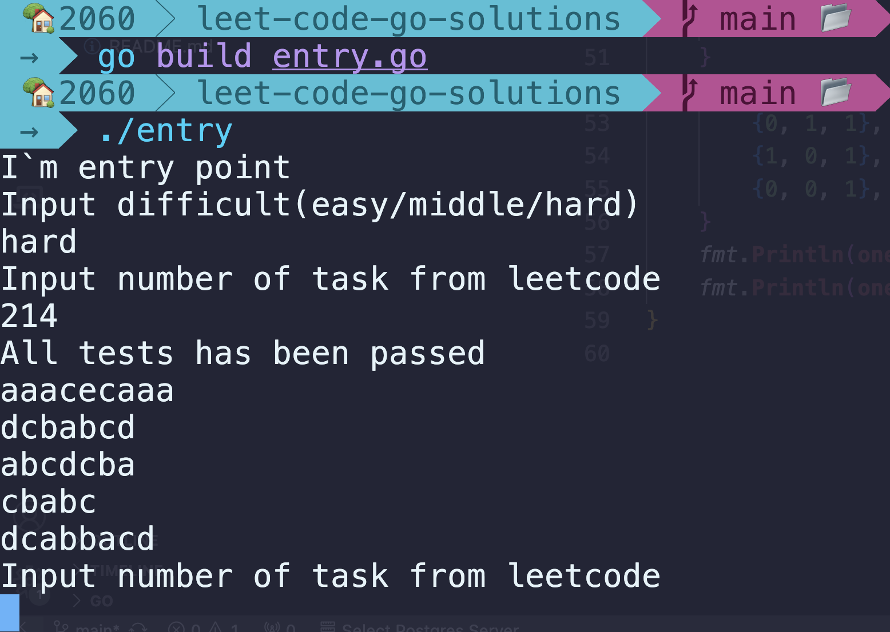

Hello

It\`s mine multifile leet project with menu for checking my solutions for leetcode problems 
To pick one choose difficulty first and then input any number of task from leetcode 
If i complete it, you will find out test output,  
if not, you will get a message "i haven\`t done it yet"

<h2> How to use it?</h2>
<h3> 1) go build entry.go </h3>
<h3> 2) ./entry </h3>
Like at the screen below!

